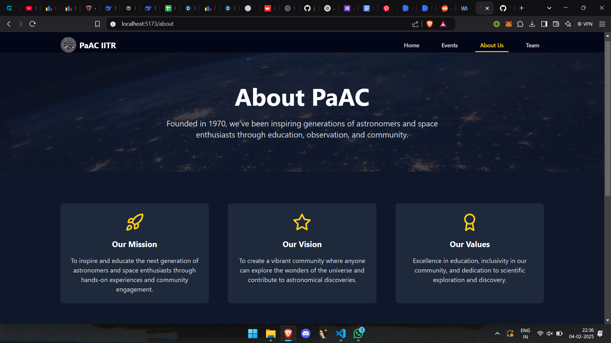

# Physics and Astronomy Club Website

## Overview
The Physics and Astronomy Club (PaAC) website serves as a central hub for students and astronomy enthusiasts to stay updated with upcoming events, educational resources, and community activities. The website features a **modern design**, **interactive elements**, and **smooth navigation** for an engaging user experience.

## Features
- **Home Page** – Introduction to the club and its mission.
- **Events Page** – Lists upcoming observation sessions, lectures, and competitions.
- **About Us** – Details about the club, its vision, and activities.
- **Team Page** – Showcases the dedicated members running the club.
- **Mobile Responsive** – Optimized for all screen sizes.
- **Interactive Animations** – Powered by **Framer Motion**.

## Tech Stack
- **Frontend**: React, Tailwind CSS, Framer Motion, Typescript
- **Routing**: React Router

---

## Pages

### 1. Home Page
- Welcomes visitors with a **hero section** and a brief overview.
- Highlights the club's **goals and activities**.
- **Call-to-action** buttons for joining or learning more.

#### Screenshot:


---

### 2. Events Page
- Displays a list of upcoming events with **dates, descriptions, and images**.
- Uses motion effects for a **dynamic user experience**.
- Allows visitors to **explore past and upcoming events**.

#### Screenshot:


---

### 3. About Us
- Provides a detailed **history and mission** of the Physics and Astronomy Club.
- Features an **engaging layout with images and animations**.

#### Screenshot:


---

### 4. Team Page
- Showcases **key members** of the club with names and roles.
- Includes hover effects for **interactive profiles**.

#### Screenshot:


---

## Installation & Setup

### Prerequisites
Ensure you have the following installed:
- **Node.js** (v16+)
- **npm** or **yarn**

### Steps to Run Locally
```sh
# Clone the repository
git clone https://github.com/your-repo/PaAC-website-mini.git

# Navigate to the project folder
cd PaAC-website-mini

# Install dependencies
npm install

# Start the development server
npm run dev
```

The website will be accessible at `http://localhost:5173/`.

---

## Contributing
We welcome contributions! To contribute:
1. Fork the repository.
2. Create a new branch (`git checkout -b feature-branch`).
3. Make your changes and commit (`git commit -m "Added new feature"`).
4. Push to your branch (`git push origin feature-branch`).
5. Submit a pull request.

---

## License
This project is licensed under the [MIT License](LICENSE).

---

## Contact
For any questions or collaboration opportunities, reach out via:
- **Email**: contact@paac-iitr.com
- **Social Media**: [Facebook](#), [Instagram](#), [Twitter](#)

---

_Enjoy exploring the universe with us!_ 🚀🔭

